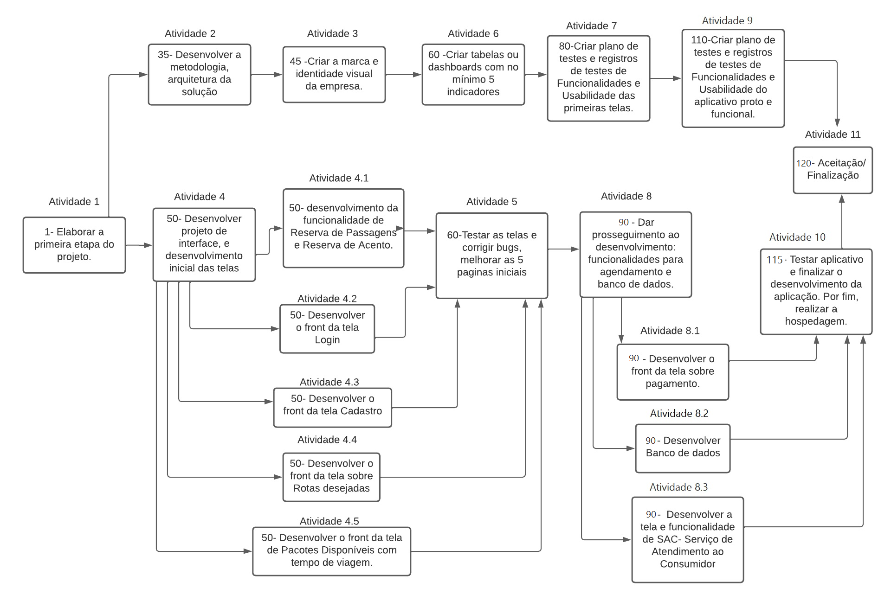
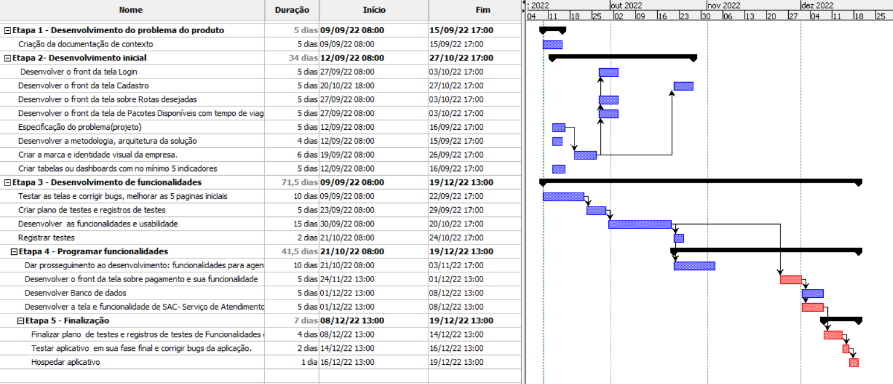
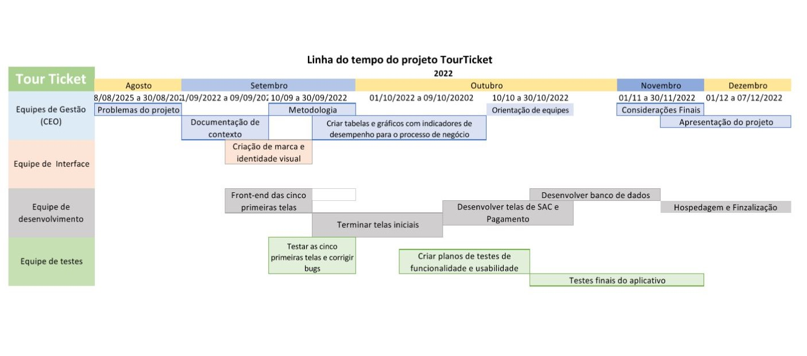
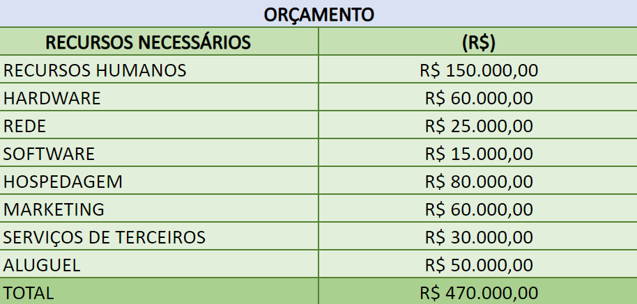

# Especificações do Projeto

Pré-requisitos: <a href="1-Documentação de Contexto.md"> Documentação de Contexto</a>

Definição do problema e ideia de solução a partir da perspectiva do usuário. É composta pela definição do  diagrama de personas, histórias de usuários, requisitos funcionais e não funcionais além das restrições do projeto.

Apresente uma visão geral do que será abordado nesta parte do documento, enumerando as técnicas e/ou ferramentas utilizadas para realizar a especificações do projeto

## Personas

Pedro Paulo tem 26 anos, é arquiteto recém-formado e autônomo. Pensa em se desenvolver profissionalmente através de um mestrado fora do país, pois adora viajar, é solteiro e sempre quis fazer um intercâmbio. Está buscando uma agência que o ajude a encontrar universidades na Europa que aceitem alunos estrangeiros.

| Madalena Fernandes | Inês Silva | Ênio Braga |
| ---        |    ----   |          --- |
|      |        |  |
| Idade: 69 anos  Ocupação: Guia turístico (autônomo)| Idade: 29 anos  Ocupação: Empreendedora no ramo de salgados para lanchonetes e festas       | Idade: 45 anos  Ocupação: Funcionário público |
| Hobbies, História: <ul><li>Assistir novelas</li><li>Viajar para cidades históricas</li></ul> | Hobbies, História: <ul><li>Passear aos fins de semana com a família</li><li>Ler bons livros</li></ul>  | Hobbies, História: <ul><li>Viajar, ler bons livros, visitar cidades históricas</li><li>Cuidar do jardim de sua casa</li></ul> |
| Motivações:  <ul><li>Conseguir dar feedbacks mais rápidos e precisos a clientes</li><li>Manter um bom equilíbrio entre trabalho e vida pessoal</li><li>Fidelizar clientes com a qualidade do atendimento</li></ul> | Motivações:  <ul><li>A satisfação de um serviço bem prestado focando na total satisfação do cliente</li><li>Uma rotina de trabalho equilibrada</li></ul>           | Motivações:  <ul><li>Poder proporcionar uma melhor qualidade de vida para a família, melhores escolas e lazer para os filhos</li><li>Conseguir maior flexibilidade no trabalho</li></ul>   |
| Frustrações:  <ul><li>Não conseguir organizar bem a jornada de trabalho e serviços pendentes</li><li>Não ter um canal de comunicação mais eficiente com clientes</li><li>Não fidelizar a quantidade de clientes que considera possível</li></ul> | Frustrações:  <ul><li>Ter que fazer longas pesquisas e em diversos canais de comunicação para encontrar o que preciso</li><li>Não ter uma “pessoa” que ateste a confiabilidade dos serviços que serão prestados</li></ul> | Frustrações:  <ul><li>Desencontro de informações passadas pelos prestadores de serviços</li><li>Dificuldade em pesquisar serviços pela internet (Google)</li></ul>  |

Enumere e detalhe as personas da sua solução. Para tanto, baseie-se tanto nos documentos disponibilizados na disciplina e/ou nos seguintes links:

> **Links Úteis**:
> - [Rock Content](https://rockcontent.com/blog/personas/)
> - [Hotmart](https://blog.hotmart.com/pt-br/como-criar-persona-negocio/)
> - [O que é persona?](https://resultadosdigitais.com.br/blog/persona-o-que-e/)
> - [Persona x Público-alvo](https://flammo.com.br/blog/persona-e-publico-alvo-qual-a-diferenca/)
> - [Mapa de Empatia](https://resultadosdigitais.com.br/blog/mapa-da-empatia/)
> - [Mapa de Stalkeholders](https://www.racecomunicacao.com.br/blog/como-fazer-o-mapeamento-de-stakeholders/)
>
Lembre-se que você deve ser enumerar e descrever precisamente e personalizada todos os clientes ideais que sua solução almeja.

## Histórias de Usuários

Com base na análise das personas forma identificadas as seguintes histórias de usuários:

|EU COMO... `PERSONA`| QUERO/PRECISO ... `FUNCIONALIDADE` |PARA ... `MOTIVO/VALOR`                 |
|--------------------|------------------------------------|----------------------------------------|
|Guia turístico | Efetuar cadastro de uma conta na aplicação e manutenção principalmente em nas formas de pagamento que disponho | Ter acesso ao meu cadastro geral, não só para visualização mas também, se necessário, fazer manutenção de endereço residencial e opções de pagamento que registrei |
|Guia turístico | Efetuar o cadastro, alteração e exclusão dos anúncios dos serviços que prestarei | Que a gestão dos anúncios sejam realizadas de forma centralizada e em um único sistema |
|Guia turístico | Consultar tirar dúvidas dos clientes através de perguntas enviadas pelos clientes | Que seja centralizada as dúvidas no produto a ser adquirido pelo cliente para que informações não fiquem desencontradas |
|Guia turístico | Possibilitar o cliente a efetuar a compra na própria plataforma | Diminuir as visitas aos domicílios dos clientes para efetuar cobranças referentes aos pacotes adquiridos |
|Guia turístico | Cadastro de motoristas de ônibus para realizar as viagens disponibilizadas | Ter um local onde possa ser consultado e contratado um motorista para fazer o translados dos passageiros |
|Guia turístico | Ter relatórios de conciliação dos valores pagos e pacotes vendidos | Ter uma forma mais amigável e confiável para verificar os valores recebidos, a receber e/ou devolvidos aos clientes |
|Inês Silva (cliente) | Pesquisar na plataforma os destinos preteridos filtrando por locais (uf / cidade), prestadores de serviço, e data aproximada | Encontrar de forma simples e fácil, às informações sobre o destino informado e quais prestadores ofertam os pacotes |
|Inês Silva (cliente) | Poder efetuar confirmação e pagamento do pacote pela plataforma | Facilidade para fechar os pedidos, de forma segura e confiável, efetuar os pagamentos com cartões referentes aos serviços contratados e até mesmo parcelamento via boletos e/ou PIX |
|Ênio Gaspari (cliente) | Receber informações sobre o pacote pesquisa, mesmo após os serviços serem contratados | Estar ciente de alterações nos pacotes como local de hospedagem, tipo de transporte disponibilizado e entre outros |
|Ênio Gaspari (cliente) | Visualizar histórico dos meus pedidos comprados | Conseguir visualizar informações sobre os pacotes contratados, pagamentos realizados e etc. |

Apresente aqui as histórias de usuário que são relevantes para o projeto de sua solução. As Histórias de Usuário consistem em uma ferramenta poderosa para a compreensão e elicitação dos requisitos funcionais e não funcionais da sua aplicação. Se possível, agrupe as histórias de usuário por contexto, para facilitar consultas recorrentes à essa parte do documento.

> **Links Úteis**:
> - [Histórias de usuários com exemplos e template](https://www.atlassian.com/br/agile/project-management/user-stories)
> - [Como escrever boas histórias de usuário (User Stories)](https://medium.com/vertice/como-escrever-boas-users-stories-hist%C3%B3rias-de-usu%C3%A1rios-b29c75043fac)
> - [User Stories: requisitos que humanos entendem](https://www.luiztools.com.br/post/user-stories-descricao-de-requisitos-que-humanos-entendem/)
> - [Histórias de Usuários: mais exemplos](https://www.reqview.com/doc/user-stories-example.html)
> - [9 Common User Story Mistakes](https://airfocus.com/blog/user-story-mistakes/)

## Modelagem do Processo de Negócio 

### Análise da Situação Atual

Apresente aqui os problemas existentes que viabilizam sua proposta. Apresente o modelo do sistema como ele funciona hoje. Caso sua proposta seja inovadora e não existam processos claramente definidos, apresente como as tarefas que o seu sistema pretende implementar são executadas atualmente, mesmo que não se utilize tecnologia computacional. 

### Descrição Geral da Proposta

Apresente aqui uma descrição da sua proposta abordando seus limites e suas ligações com as estratégias e objetivos do negócio. Apresente aqui as oportunidades de melhorias.

### Processo 1 – NOME DO PROCESSO

Apresente aqui o nome e as oportunidades de melhorias para o processo 1. Em seguida, apresente o modelo do processo 1, descrito no padrão BPMN. 

### Processo 2 – NOME DO PROCESSO

Apresente aqui o nome e as oportunidades de melhorias para o processo 2. Em seguida, apresente o modelo do processo 2, descrito no padrão BPMN.

## Indicadores de Desempenho

Apresente aqui os principais indicadores de desempenho e algumas metas para o processo. Atenção: as informações necessárias para gerar os indicadores devem estar contempladas no diagrama de classe. Colocar no mínimo 5 indicadores. 

Usar o seguinte modelo: 

Obs.: todas as informações para gerar os indicadores devem estar no diagrama de classe a ser apresentado a posteriori. 

## Requisitos

As tabelas que se seguem apresentam os requisitos funcionais e não funcionais que detalham o escopo do projeto. Para determinar a prioridade de requisitos, aplicar uma técnica de priorização de requisitos e detalhar como a técnica foi aplicada.

### Requisitos funcionais
| ID  | Descrição | Prioridade |
| ------------- | ------------- | ------------- |
| RF-01 | A aplicação deve permitir cadastrar, editar e excluir pacotes de viagens | Alta |
| RF-02 | A aplicação deve informar aos usuários todos os detalhes sobre o pacote ofertado | Alta |
| RF-03 | A aplicação deve efetuar cadastro, alteração e exclusão de clientes | Alta |
| RF-04 | A aplicação deve oferecer aos usuários formas de pagamento cartão, boleto e PIX, e com opção de parcelamento | Alta |
| RF-05 | A aplicação deve permitir a escolha pelos usuário dos assentos nos ônibus | Média |
| RF-06 | A aplicação deve permitir filtrar os pacotes cadastrados de acordo com o período e disponibilidade | Alta |
| RF-07 | A aplicação deve cadastrar as atividades referentes as viagens pesquisadas pelo usuário no aplicativo | Baixa |
| RF-08 | A aplicação deve oferecer aos usuários formas de pagamento cartão, boleto e PIX, e com opção de parcelamento | Alta |
| RF-09 | A aplicação deve disponibilizar ao cliente todo o seu histórico de compras | Média |
| RF-10 | A aplicação deve disponibilizar um canal de mediação de conflitos entre o prestador de serviço e cliente | Média |
| RF-11 | A aplicação deve emitir notificações sobre horários de cada viagem | Média |
| RF-12 | A aplicação deve disponibilizar relatórios de conciliação de viagens X faturamento | Média |

### Requisitos não-funcionais

| ID  | Descrição | Prioridade |
| ------------- | ------------- | ------------- |
| RNF-01 | O site deve ser publicado em algum repositório público acessível na internet. | Alta |
| RNF-02 | O sistema deve ser responsivo para rodar em um dispositivo móvel  | Alta |
| RNF-03 | O sistema deve processar requisições do usuário em no máximo 3s | Baixa |
| RNF-04 | Opção de marcar os tópicos de atividades que foram concluídos com checkbox. | Média |
| RNF-05 | O sistema deve Executar nas plataformas ios e android. | Alta |
| RNF-06 | O sistema deve emitir relatório por usuário. | Média | 
| RNF-07 | O sistema deve permitir informações cadadatrais offline. |Alta| 

Com base nas Histórias de Usuário, enumere os requisitos da sua solução. Classifique esses requisitos em dois grupos:

- [Requisitos Funcionais
 (RF)](https://pt.wikipedia.org/wiki/Requisito_funcional):
 correspondem a uma funcionalidade que deve estar presente na
  plataforma (ex: cadastro de usuário).
- [Requisitos Não Funcionais
  (RNF)](https://pt.wikipedia.org/wiki/Requisito_n%C3%A3o_funcional):
  correspondem a uma característica técnica, seja de usabilidade,
  desempenho, confiabilidade, segurança ou outro (ex: suporte a
  dispositivos iOS e Android).
Lembre-se que cada requisito deve corresponder à uma e somente uma
característica alvo da sua solução. Além disso, certifique-se de que
todos os aspectos capturados nas Histórias de Usuário foram cobertos.

## Restrições

O projeto está restrito pelos itens apresentados na tabela a seguir.

|ID| Restrição                                             |
|--|-------------------------------------------------------|
|01| O projeto deverá ser entregue até o final do semestre |
|02| Não pode ser desenvolvido um módulo de backend        |

Enumere as restrições à sua solução. Lembre-se de que as restrições geralmente limitam a solução candidata.

> **Links Úteis**:
> - [O que são Requisitos Funcionais e Requisitos Não Funcionais?](https://codificar.com.br/requisitos-funcionais-nao-funcionais/)
> - [O que são requisitos funcionais e requisitos não funcionais?](https://analisederequisitos.com.br/requisitos-funcionais-e-requisitos-nao-funcionais-o-que-sao/)

## Diagrama de Casos de Uso

O diagrama de casos de uso é o próximo passo após a elicitação de requisitos, que utiliza um modelo gráfico e uma tabela com as descrições sucintas dos casos de uso e dos atores. Ele contempla a fronteira do sistema e o detalhamento dos requisitos funcionais com a indicação dos atores, casos de uso e seus relacionamentos. 

Segue O Diagrama de Caso de Uso para a aplicação Tour Tickets

# Matriz de Rastreabilidade

A matriz de rastreabilidade é uma ferramenta usada para facilitar a visualização dos relacionamento entre requisitos e outros artefatos ou objetos, permitindo a rastreabilidade entre os requisitos e os objetivos de negócio. 

Segue a matriz de rastreabilidade 

# Gerenciamento de Projeto

De acordo com o PMBoK v6 as dez áreas que constituem os pilares para gerenciar projetos, e que caracterizam a multidisciplinaridade envolvida, são: Integração, Escopo, Cronograma (Tempo), Custos, Qualidade, Recursos, Comunicações, Riscos, Aquisições, Partes Interessadas. Para desenvolver projetos um profissional deve se preocupar em gerenciar todas essas dez áreas. Elas se complementam e se relacionam, de tal forma que não se deve apenas examinar uma área de forma estanque. É preciso considerar, por exemplo, que as áreas de Escopo, Cronograma e Custos estão muito relacionadas. Assim, se eu amplio o escopo de um projeto eu posso afetar seu cronograma e seus custos.

## Gerenciamento de Tempo

Diagrama criado para estimar o tempo necessário de conclusão do projeto, exemplificando um esquema de representação do tempo estimado e tarefas que serão executadas durante o período.

É possível ver os detalhes das etapas e suas respetivas tarefas na tabela abaixo, seguindo o seguinte esquema de organização: Tarefas, tempo de execução, datas limite para execução e por fim os antecessores, na tablea atecessores é especificado qual tarefa precisa ser cumprida para o inicio da etapa seguinte.

## Gerenciamento de Equipe

O gerenciamento adequado de tarefas contribuirá para que o projeto alcance altos níveis de produtividade. Por isso, é fundamental que ocorra a gestão de tarefas e de pessoas, de modo que os times envolvidos no projeto possam ser facilmente gerenciados. 

## Gestão de Orçamento

O processo de determinar o orçamento do projeto é uma tarefa que depende, além dos produtos (saídas) dos processos anteriores do gerenciamento de custos, também de produtos oferecidos por outros processos de gerenciamento, como o escopo e o tempo.

