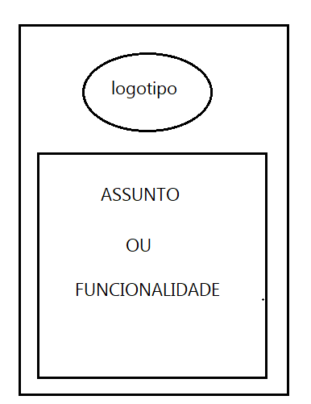
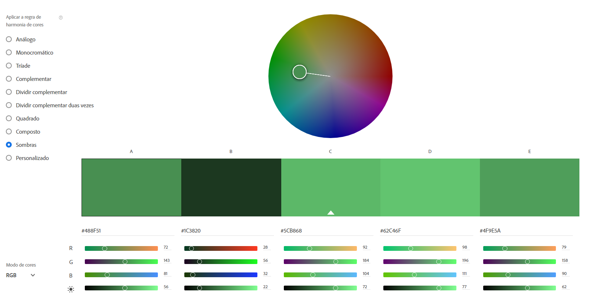
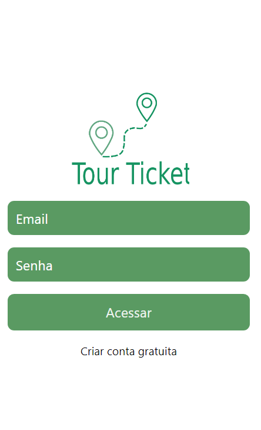

# Template Padrão da Aplicação

Pré-requisitos: <a href="2-Especificação do Projeto.md"> Especificação do Projeto</a>, <a href="3-Projeto de Interface.md"> Projeto de Interface</a>, <a href="4-Metodologia.md"> Metodologia</a>

Layout padrão da aplicação que será utilizado em todas as páginas com a definição de identidade visual, aspectos de responsividade e iconografia.

Usando as logo como referência visual da marca do negócio: 

## Esquema de cores

O esquema de cores escolhido partirá de uma variação monocromática do verde musgo, como demonstrado na imagem abaixo, podendo ter uma pequena variação no tom das cores durante o desenvolvimento e escolha da equipe de UX/UI

## Tela principal

Ao entrar no aplicativo o usuário(a,e) poderá fazer o login, clicar em saiba mais e cadastrar-se.

## Tela principal- Acesso

A tela inicial pode ser acessada pelo QR code através do aplicativo EXPO GO

> **Links Úteis**:
>
> - [CSS Website Layout (W3Schools)](https://www.w3schools.com/css/css_website_layout.asp)
> - [Website Page Layouts](http://www.cellbiol.com/bioinformatics_web_development/chapter-3-your-first-web-page-learning-html-and-css/website-page-layouts/)
> - [Perfect Liquid Layout](https://matthewjamestaylor.com/perfect-liquid-layouts)
> - [How and Why Icons Improve Your Web Design](https://usabilla.com/blog/how-and-why-icons-improve-you-web-design/)
