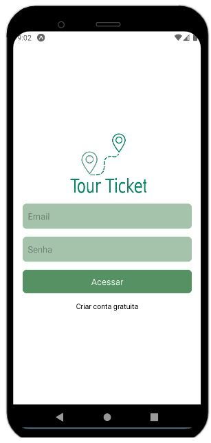

# Programação de Funcionalidades

Pré-requisitos: <a href="2-Especificação do Projeto.md"> Especificação do Projeto</a>, <a href="3-Projeto de Interface.md"> Projeto de Interface</a>, <a href="4-Metodologia.md"> Metodologia</a>, <a href="3-Projeto de Interface.md"> Projeto de Interface</a>, <a href="5-Arquitetura da Solução.md"> Arquitetura da Solução</a>

A primeira funcionalidade desenvolvida foi a correspodente ao requisito funcional RF-013 (A aplicação deve permitir que o usuário faça login e acesse um campo para recuperar a senha e cadastro). 

Na parte superior da tela encontra-se a logo do projeto, com sua definição de identidade visual. Usando um degradê da cor verde em seus campos de input e botões. 

A tela de login oferece ao usuário um formulário para preenchimento do login com os campos: email e senha e  um botão para Acessar. Além disso há um botão de direcionamento para a tela de cadastro. 

A tela até a segunda etapa do projeto estava apenas com as definições do campo que estão em desenvolvimento para a primeira etapa. 

Imagem da primeira tela: 

# Evolução do projeto

**Fernanda Araújo Macieira**

Foi responsável por implementar, na etapa 3, a tela de cadatro de viagens.

> - Cadastro de viagens: o usuário tem a opção de registrar qual viagem ele vai programar e vender os assentos disponiveis.
> 
> 

