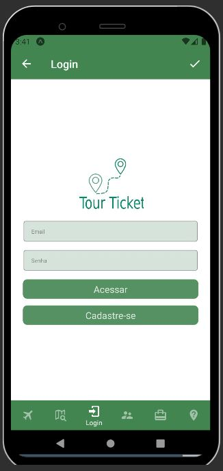
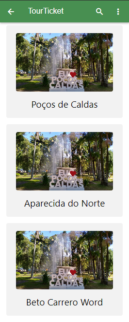

# Programação de Funcionalidades

Pré-requisitos: <a href="2-Especificação do Projeto.md"> Especificação do Projeto</a>, <a href="3-Projeto de Interface.md"> Projeto de Interface</a>, <a href="4-Metodologia.md"> Metodologia</a>, <a href="3-Projeto de Interface.md"> Projeto de Interface</a>, <a href="5-Arquitetura da Solução.md"> Arquitetura da Solução</a>

# Evolução do projeto

**Programação- Tiago**
Explicação geral no link: https://youtu.be/gGD3bJZApgU

**Link Expo- Tiago**: https://snack.expo.dev/@tiagomg/tour-ticket?platform=android

**Componetização:**

Foram feitas as componetização dos principais recursos usados nas páginas (Tiago), como os botões, header, Container, Body, Input, Logo, e campo onde recebe as viagens. 

A primeira funcionalidade desenvolvida foi a correspodente ao requisito funcional RF-013 (A aplicação deve permitir que o usuário faça login e acesse um campo para recuperar a senha e cadastro). 

Na parte superior da tela encontra-se a logo do projeto, com sua definição de identidade visual. Usando um degradê da cor verde em seus campos de input e botões. 

A tela de login oferece ao usuário um formulário para preenchimento do login com os campos: email e senha e  um botão para Acessar. Além disso há um botão de direcionamento para a tela de cadastro. 

*Tela completamente componetizada*

Imagem da tela de login: 

De acordo com o requisito funcional RF-02	- A aplicação deve informar aos usuários todos os detalhes sobre o pacote ofertado, será feito uma introdução dos dados na tela de vitrine e na tela de descrição. 

No código foi possível fazer uma limitação dos caracteres que serão recebidos pelos anuncios. Além de receber propriedades de navegação e botões de acesso para a página de login e de dúivdas. 

*Imagem tela de Vitrine:* 

**Fernanda Araújo Macieira**

Foi responsável por implementar, na etapa 3, a tela de cadatro de viagens.

> - Cadastro de viagens: o usuário tem a opção de registrar qual viagem ele vai programar e vender os assentos disponiveis.
> 
> 

## Tela vitrine de anúncios

Após o login do usário, os anúncios de pacotes de viagens serão exibidos listados na tela de vitrine de produtos. Esta tela foi desenvolvida para atender o requisito RF-06. A tela apresentada abaixo está sendo desenvolvida com as seguintes funcionalidades

> - Lista de anúncios dos pacotes de viagens com apresentação de image, título, data da viagem e valor do pacote;
> - Pesquisa por anúncios publicados ou percorrer a tela do app visualizar a lista de anúncios listados;
> - Acesso ao menu, onde poderá acessar os dados do usuário, detalhes de suas compras e entre outros.

**Mislene Tavares Cota**

Mislene Gravação do Vídeo no link: https://photos.app.goo.gl/r9Ty19sN2QemqH8U8

Link Expo- Mislene: [https://snack.expo.dev/?platform=android](https://snack.expo.dev/?platform=android)

Foi responsável por implementar, na etapa 3, a tela de cadatro de usuário e a Tela de FAQ.

*Imagem tela de Cadastro De Usuário:* 

*Imagem tela Da Tela De FAQ:* 

